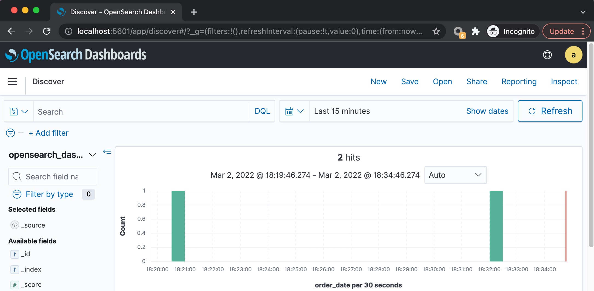
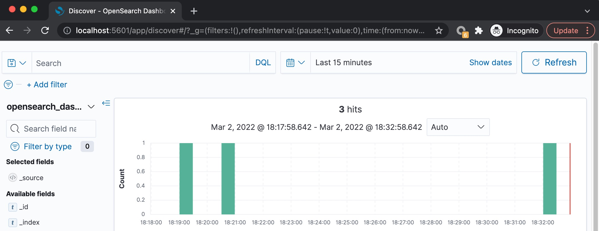

# hideHeader

A OpenSearch Dashboards plugin to hide the page header (include nav and menu).

Before:



After:



---

## Development

1. Clone https://github.com/opensearch-project/OpenSearch-Dashboards and run it by following the [developer guide](https://github.com/opensearch-project/OpenSearch-Dashboards/blob/main/DEVELOPER_GUIDE.md)
1. Clone this repo under the `OpenSearch-Dashboards/plugins` folder
1. Re-Run the OpenSearch-Dashboards, refresh the browser, you can see the effect

## Publish

1. Run `yarn build` under the root folder of this repo, it will ask you what version the target OpenSearch Dashboards, fill the target version, the value must match the deployed OpenSearch Dashboards version, for example: `1.2.0`
1. It will build the puglin and generate a zip file in the `build` folder
1. Copy the zip file to where you put your OpenSearch Dashboards binaries folder, and unzip it to the plugins folder.

   ```
    opensearch-dashboards-1.2.0-linux-x64$ ls
    LICENSE.txt  NOTICE.txt  README.txt  bin  config  data  manifest.yml  node  node_modules  package.json  plugins  src

    opensearch-dashboards-1.2.0-linux-x64$ cd plugins/
    opensearch-dashboards-1.2.0-linux-x64/plugins$ ls
    alertingDashboards          ganttChartDashboards  indexManagementDashboards  queryWorkbenchDashboards  securityDashboards
    anomalyDetectionDashboards  hideHeader-1.2.0.zip  observabilityDashboards    reportsDashboards

    opensearch-dashboards-1.2.0-linux-x64/plugins$ unzip hideHeader-1.2.0.zip
   ```

1. Re-Run the OpenSearch Dashboards

## Core Code

```ts
export class HideHeaderPlugin implements Plugin<HideHeaderPluginSetup, HideHeaderPluginStart> {
  private removeHeader() {
    const observer = new MutationObserver((mutations) => {
      console.log('mutations:', mutations);

      for (const mutation of mutations) {
        for (let i = 0; i < mutation.addedNodes.length; i++) {
          const node = mutation.addedNodes[i];
          if (!(node instanceof HTMLElement)) continue;
          if (node.nodeName === 'HEADER' && node.classList.contains('headerGlobalNav')) {
            node.firstChild?.remove();
            document.body.style.paddingTop = '10px';
            observer.disconnect();
            break;
          }
        }
      }
    });
    observer.observe(document.body, { childList: true, subtree: true });
  }

  public setup(core: CoreSetup): HideHeaderPluginSetup {
    console.log('load hide header plugin');
    this.removeHeader();
    // ...
  }
}
```

Other codes are generated by scaffold and useless, can be removed.

## Ref

- [Introduction to OpenSearch Dashboard Plugins](https://opensearch.org/blog/technical-post/2022/01/dashboards-plugins-intro/)
